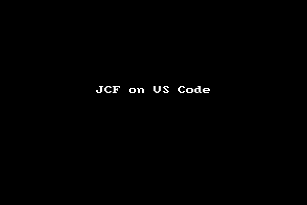

# Jedi Code Formatter CLI

I took [Jedi Code Formatter](http://jedicodeformat.sourceforge.net/) (JCF) from [Lazarus IDE repository](https://github.com/graemeg/lazarus/tree/upstream/components/jcf2) and made it as CLI (command line interface) version by removing all the GUI (graphical user interface) parts from the original GUI version. The CLI version can be used as Pascal code formatter in [Visual Studio Code](https://code.visualstudio.com/), or as backend engine of an online [Pascal code beautifier](https://pak.lebah.web.id/jcf).

## How To Build Using Lazarus

1. You must have [Lazarus IDE](https://lazarus-ide.org) already installed on your system.
2. Clone or download this `jcf-cli` GitHub repo into your own folder.
3. Start your Lazarus IDE and open `jcf.lpi` project within `jcf-cli/CommandLine/Lazarus` folder.
4. Build it via Lazarus' **Run** → **Build** menu.
5. Wait while Lazarus is building the JCF project.
6. Take the executable `JCF` file from `jcf-cli/Output/Lazarus` folder along with the `jcf.xml` configuration file.
7. Just to make sure, test it from Terminal using `./JCF -?` command. It should show the usage manual.

## How To Build Using VS Code

1. You must have [VS Code](https://code.visualstudio.com) already installed on your system.
2. Clone or download this `jcf-cli` GitHub repo into your own folder.
3. Start your VS Code and open `jcf.lpr` project within `jcf-cli/CommandLine/Lazarus` folder. Or you could use the provided **JCF: Open CLI Project** from the **Tasks** menu.
4. Build it via VS Code's **Tasks** → **Run Task...** → **JCF: Build Release** menu.
5. Wait while FPC is building the JCF project.
6. Open `test.pas` file from `jcf-cli` folder.
7. Test `JCF` program using **Tasks** → **Run Task...** → **JCF: Test CLI Program** menu and you should see the result in the `test.pas` file.

> Note: I've included the executable file for Linux, Mac, and Windows in [`Output/Lazarus`](Output/Lazarus) folder so you don't need to build it yourself. However, it's **not** guaranteed using the latest modification. 😊

## How To Use JCF in VS Code

1. Copy the `JCF` **and** `jcf.xml` config files into your Pascal workspace folder.
2. Create a new VS Code task or open the `tasks.json` if you already have one.
3. Copy the task example below and paste it into your `tasks.json` file.  

  ```json
  {
    "label"  : "fpc: Beautify Code",
    "type"   : "shell",
    "command": "./JCF",
    "args": [
      "${file}",
      "-clarify",
      "-inplace",
      "-config=jcf.xml"
    ],
    "presentation": {
      "reveal": "never"
    },
    "problemMatcher": []
  },
```
4. It's a task to beautify Pascal code.
5. If you need a task to obfuscate code, simply make another task using the code above, but then change `-clarify` arg into `-obfuscate`.
6. Save your `tasks.json`. Now you should have new JCF's tasks in your tasks list.

## Demo

Here's JCF CLI in action within VS Code (with [OmniPascal](http://www.omnipascal.com/)):



> Note: If you're also interested in my other tasks shown in the demo, see my gist about it [here](https://gist.github.com/pakLebah/dab98067e9a388a3a8d2f5c0b44a7d3f).

Hope it's gonna be useful to other Pascal fellows out there. Have fun! 😊
